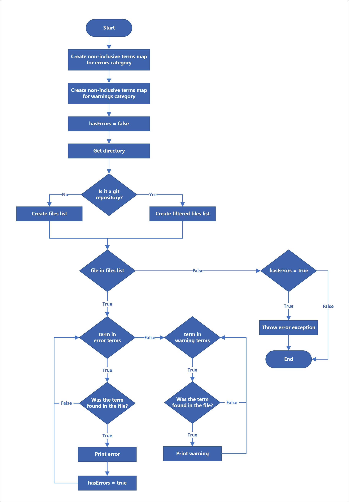

# Search Engine

The `inclusivelint` search engine looks for non-inclusive terminologies (internally described as *contraventions*) on directories, specially optimized for Git repositories. If the engine detects the directory is a Git repository (i.e. the directory has a `.git` folder), it looks for non-inclusive terminologies only on files that are not listed on the `.gitignore`.

